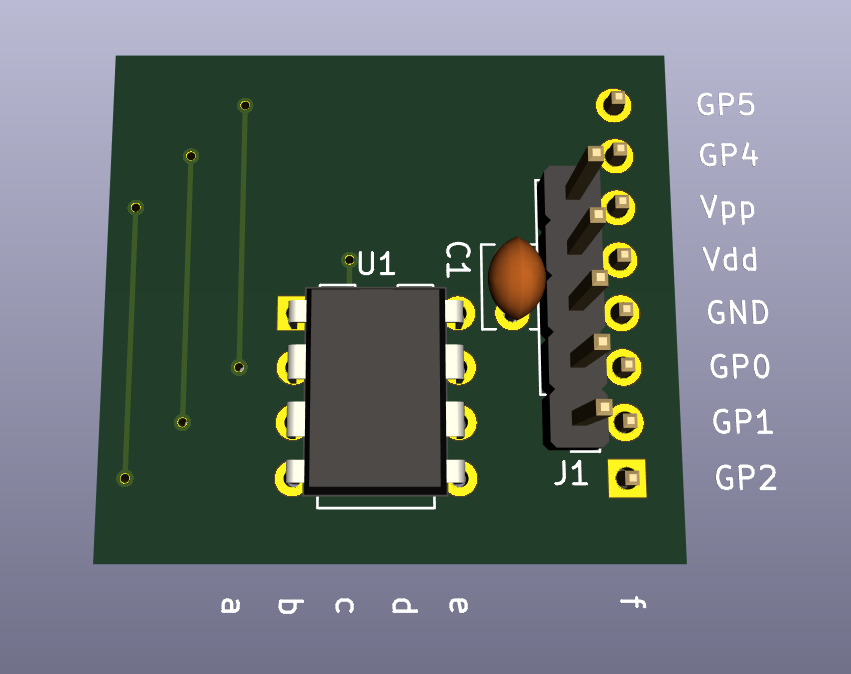
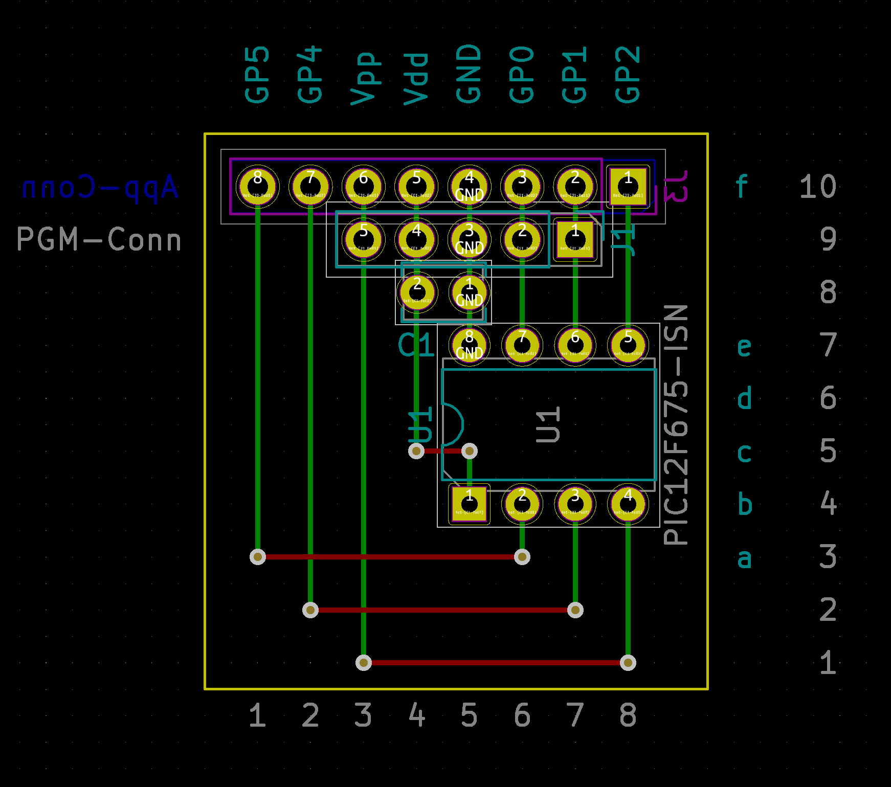

Development board for PIC12/PIC16 microcontrollers
==================================================

This repository contains the design-files (Kicad) for a PIC12/PIC16 development board.

PCB Version
-----------

Work in progress, see directory `pic-dev-board.kicad`.

Minimal Stripboard Version
--------------------------

In the directory `pic12-dev-stripboard.kicad` you find the schema and layout for
a minimal stripboard version:

This is a simple solution for plugging a PIC12 into a breadboard.

This version is not meant for ICSP (in-circuit serial
programming), since it does not have any components to guard the rest of the
circuit during programming.

