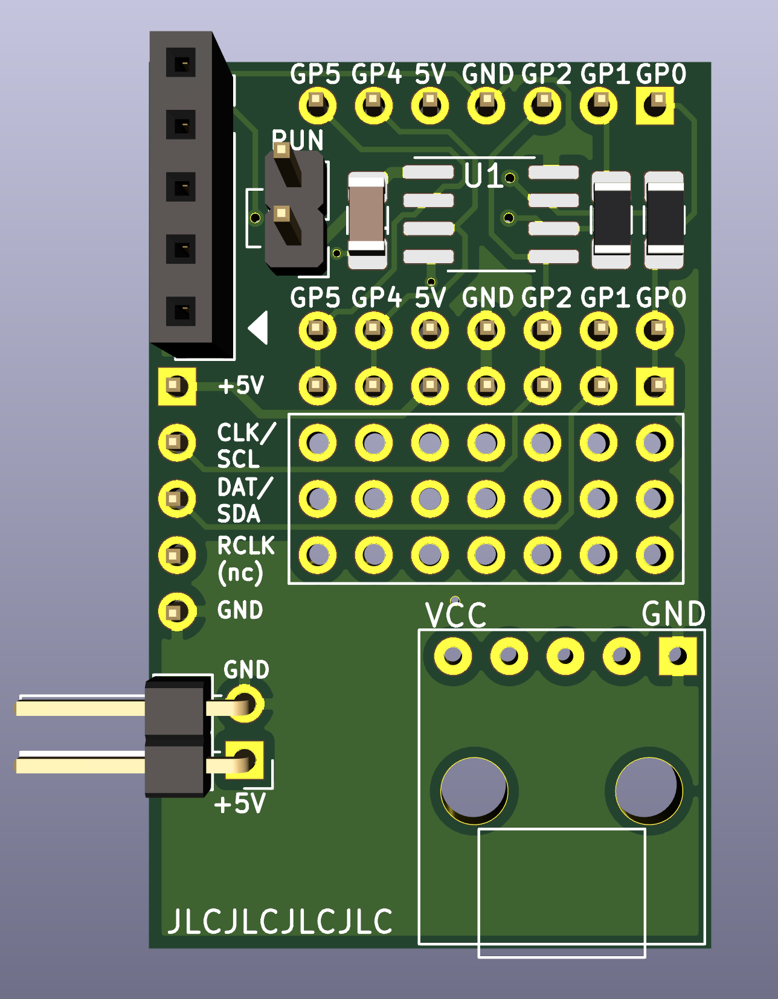

Development board for PIC12/PIC16 microcontrollers
==================================================

This repository contains the design-files (Kicad) for three PIC12/PIC16
development boards.

PIC-Dev-Board
-------------

This is a full sized dev-board, see directory `pic-dev-board.kicad`:

It supports:

  - a PIC12 or a 20-pin PIC16
  - configurable pullups or LEDs on GP0-GP5
  - two shift-registers with LEDs to output 8-16 bits using two GPs
    (see [project pic-sn74hc595](https://github.com/bablokb/pic-sn74hc595))
  - a LCD1602 attached to the first shift-register
    (see [project pic-hd44780_lcd](https://github.com/bablokb/pic-hd44780_lcd))
  - ICSP programming
  - all pins broken out to connectors (TRISB/TRISC only available for PIC16)
  - a large prototyping-area

PIC12-Dev-PCB
-------------

This is a small dev-board for PIC12 MCUs designed for plugging into a
breadboard, see directory `pic12-dev-pcb`:

It supports:

  - PIC12 in SO-8 package
  - ICSP programming
  - connector for an external SN74HC595-pcb
    (see [project pic-sn74hc595](https://github.com/bablokb/pic-sn74hc595)
  - also usable as I2C-connector
  - power-supply using a small micro-USB-connector breakout
  - connector for power-out (should align with the power-rails of the breadboard)
  - a small prototyping area

Minimal Stripboard Version
--------------------------

In the directory `pic12-dev-stripboard.kicad` you find the schema and layout for
a minimal stripboard version:

This is a simple solution for plugging a PIC12 into a breadboard.

This version is not meant for ICSP (in-circuit serial
programming), since it does not have any components to guard the rest of the
circuit during programming.

